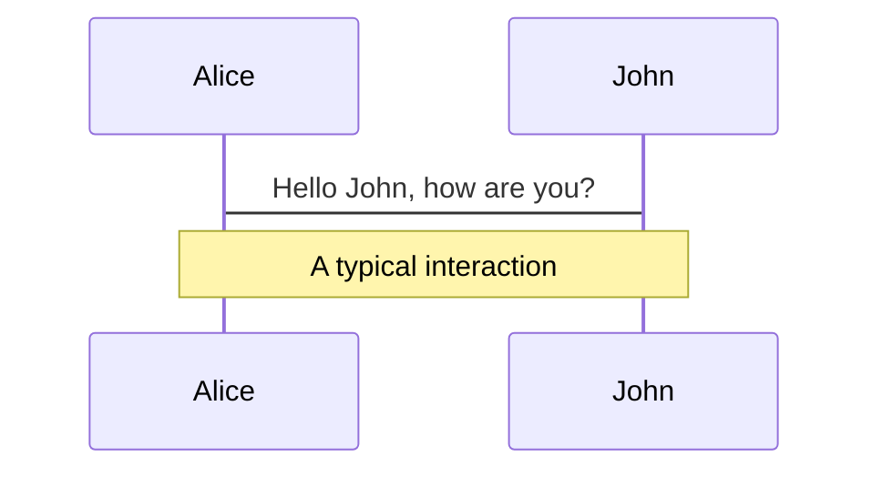
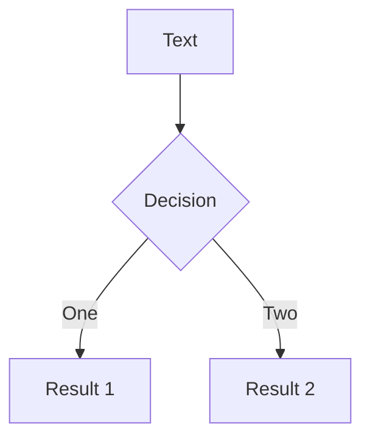

---
# try also 'default' to start simple
theme: default
# random image from a curated Unsplash collection by Anthony
# like them? see https://unsplash.com/collections/94734566/slidev
background: ./images/typescript-bg.png
# apply any windi css classes to the current slide
class: 'text-center'
# https://sli.dev/custom/highlighters.html
highlighter: shiki
title: Type System within TypeScript
# some information about the slides, markdown enabled
info: |
  ## Type System within TypeScript

  Explore a powerful type system through this talk if you have never used TypeScript before.

  by Ziyang Zeng
---

# <span class="golden-font">Type</span> System within <span class="golden-font">Type</span>Script

Explore the Rich Expressiveness from a Powerful Type System!

<div class="pt-12">
  <span @click="$slidev.nav.next" class="px-2 p-1 rounded cursor-pointer" hover="bg-white bg-opacity-10">
    Start the journey <carbon:arrow-right class="inline"/>
  </span>
</div>

<div
  class="abs-bl m-6 text-sm opacity-50">
  Jun 2021 @ Hotstar
</div>

<style>
.golden-font {
  background-image: linear-gradient(45deg, #f9b208, #f98404);
  background-size: 100%;
  -webkit-background-clip: text;
  -moz-background-clip: text;
  -webkit-text-fill-color: transparent;
  -moz-text-fill-color: transparent;
}
</style>
---

# Type System

The type system defines the interpretation of binary numbers for a language, mapping the values onto the underlying hardware.

<div grid="~ cols-2 gap-4">
<div>

### Static vs Dynamic type system

**Static typing**
- Variables have types.
- Compilers ensures (at compile time) that type rules are obeyed.

**Dynamic typing**
- Variables do not have types, values do.
- Compilers/Interpreters ensures (at run time) that type rules are obeyed.

</div>
<div>


### Strong vs Weak typing

**Strong typing**

- Does not allow variables to be used in a way inconsistent with their types.

**Weak typing**

- Allows many ways to bypass the type system (e.g., pointer arithmetic).


</div>
</div>

---


<div style="position: absolute; bottom: 50px;">

# What is <a target="_blank" href="https://www.typescriptlang.org"><span class="ts-title">TypeScript</span></a>?

- TypeScript ≈ <ins>JavaScript</ins> + <ins>type system</ins>
- Superset of JavaScript that transpiles to JavaScript
- Expressive type system with <span class="golden-font">SOA</span> type inference capabilities
- "JavaScript that scales."

</div>

<!--
You can have `style` tag in markdown to override the style for the current page.
Learn more: https://sli.dev/guide/syntax#embedded-styles
-->

<style>
.ts-title {
  background-image: linear-gradient(45deg, #4EC5D4, #146b8c);
  background-size: 100%;
  -webkit-background-clip: text;
  -moz-background-clip: text;
  -webkit-text-fill-color: transparent;
  -moz-text-fill-color: transparent;
}

.golden-font {
  background-image: linear-gradient(45deg, #f9b208, #f98404);
  background-size: 100%;
  -webkit-background-clip: text;
  -moz-background-clip: text;
  -webkit-text-fill-color: transparent;
  -moz-text-fill-color: transparent;
}
</style>

---

# Popularity

| # Ranking | Programming Language | Percentage |
| - | -------------------- | ---------- |
| 1 | JavaScript | 18.756% |
| 2 | Python | 16.628% |
| 3 | Java | 11.680% |
| 4 | Go | 7.829% |
| 5 | Ruby | 7.588% |
| 6 | C++ | 6.985% |
| 7 | <span class="ts-title">TypeScript</span> | 6.604% |
| 8 | PHP | 5.081% |

<span style="font-size: 14px; opacity: 0.3;">Courtesy of https://madnight.github.io/githut/#/pull_requests/2021/1</span>


<style>
.ts-title {
  background-image: linear-gradient(45deg, #4EC5D4, #146b8c);
  background-size: 100%;
  -webkit-background-clip: text;
  -moz-background-clip: text;
  -webkit-text-fill-color: transparent;
  -moz-text-fill-color: transparent;
}
</style>

---

# Navigation

Hover on the bottom-left corner to see the navigation's controls panel, [learn more](https://sli.dev/guide/navigation.html)

### Keyboard Shortcuts

|     |     |
| --- | --- |
| <kbd>right</kbd> / <kbd>space</kbd>| next animation or slide |
| <kbd>left</kbd> | previous animation or slide |
| <kbd>up</kbd> | previous slide |
| <kbd>down</kbd> | next slide |


<p v-after class="absolute bottom-23 left-45 opacity-30 transform -rotate-10">Here!</p>

---
layout: image-right
image: https://source.unsplash.com/collection/94734566/1920x1080
---

# Code

Use code snippets and get the highlighting directly!

```ts {monaco} {height:'350px'}
import {} from '@slidev/cli';


```

<arrow v-click x1="400" y1="420" x2="230" y2="330" color="#564" width="3" arrowSize="1" />

---

# Components

<div grid="~ cols-2 gap-4">
<div>

You can use Vue components directly inside your slides.

We have provided a few built-in components like `<Tweet/>` and `<Youtube/>` that you can use directly. And adding your custom components is also super easy.

```html
<Counter :count="10" />
```

Check out [the guides](https://sli.dev/builtin/components.html) for more.

</div>
<div>

```html
<Tweet id="1390115482657726468" />
```

<Tweet id="1390115482657726468" scale="0.65" />

</div>
</div>


---
class: px-20
---

# Themes

Slidev comes with powerful theming support. Themes are able to provide styles, layouts, components, or even configurations for tools. Switching between themes by just **one edit** in your frontmatter:

<div grid="~ cols-2 gap-2" m="-t-2">

```yaml
---
theme: default
---
```

```yaml
---
theme: seriph
---
```


</div>

Read more about [How to use a theme](https://sli.dev/themes/use.html) and
check out the [Awesome Themes Gallery](https://sli.dev/themes/gallery.html).

---
preload: false
---

# Animations

Animations are powered by [@vueuse/motion](https://motion.vueuse.org/).

```html
<div
  v-motion
  :initial="{ x: -80 }"
  :enter="{ x: 0 }">
  Slidev
</div>
```

<div class="w-60 relative mt-6">
  <div class="relative w-40 h-40">
    
    
    
  </div>

  <div
    class="text-5xl absolute top-14 left-40 text-[#2B90B6] -z-1"
    v-motion
    :initial="{ x: -80, opacity: 0}"
    :enter="{ x: 0, opacity: 1, transition: { delay: 2000, duration: 1000 } }">
    Slidev
  </div>
</div>

<!-- vue script setup scripts can be directly used in markdown, and will only affects current page -->
<script setup lang="ts">
const final = {
  x: 0,
  y: 0,
  rotate: 0,
  scale: 1,
  transition: {
    type: 'spring',
    damping: 10,
    stiffness: 20,
    mass: 2
  }
}
</script>

<div
  v-motion
  :initial="{ x:35, y: 40, opacity: 0}"
  :enter="{ y: 0, opacity: 1, transition: { delay: 3500 } }">

[Learn More](https://sli.dev/guide/animations.html#motion)

</div>

---

# LaTeX

LaTeX is supported out-of-box powered by [KaTeX](https://katex.org/).

<br>

Inline $\sqrt{3x-1}+(1+x)^2$

Block
$$
\begin{array}{c}

\nabla \times \vec{\mathbf{B}} -\, \frac1c\, \frac{\partial\vec{\mathbf{E}}}{\partial t} &
= \frac{4\pi}{c}\vec{\mathbf{j}}    \nabla \cdot \vec{\mathbf{E}} & = 4 \pi \rho \\

\nabla \times \vec{\mathbf{E}}\, +\, \frac1c\, \frac{\partial\vec{\mathbf{B}}}{\partial t} & = \vec{\mathbf{0}} \\

\nabla \cdot \vec{\mathbf{B}} & = 0

\end{array}
$$

<br>

[Learn more](https://sli.dev/guide/syntax#latex)

---

# Diagrams

You can create diagrams / graphs from textual descriptions, directly in your Markdown.

<div class="grid grid-cols-2 gap-4 pt-4 -mb-6">





</div>

[Learn More](https://sli.dev/guide/syntax.html#diagrams)


---
layout: center
class: text-center
---

# Learn More

[Documentations](https://sli.dev) / [GitHub Repo](https://github.com/slidevjs/slidev)
